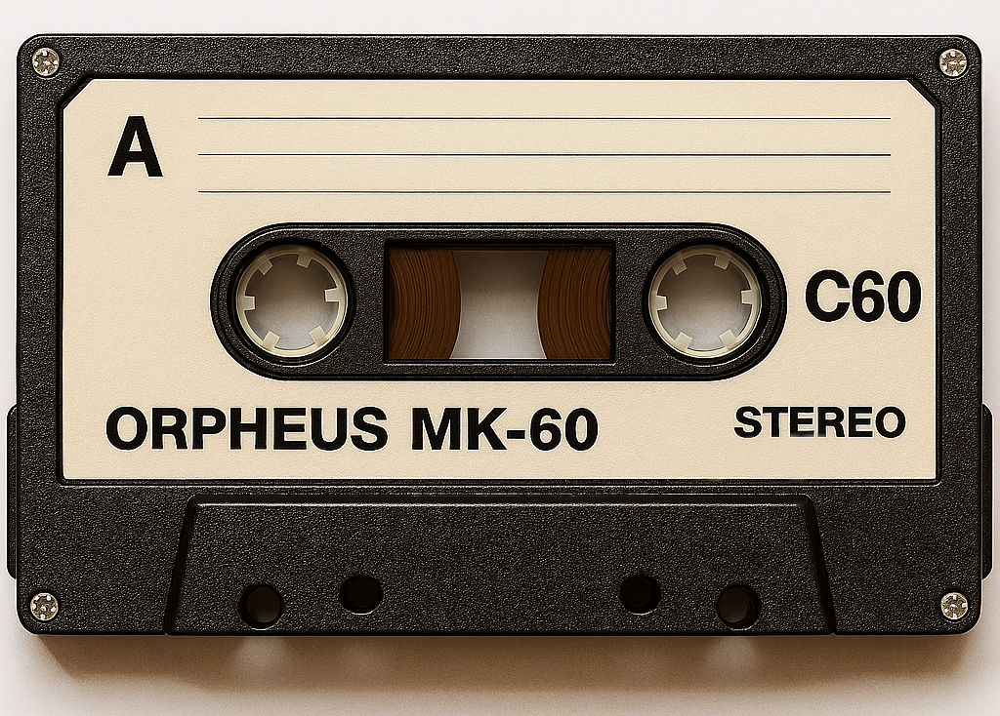

# Компьютерные игры на аудиокассетах

## Преамбула

Давным-давно домашние компьютеры использовали обычные магнитофонные кассеты в качестве носителя данных.
Обычные аудиокассеты, с которых все слушали музыку, использовались для хранения и загрузки на компьютер программ и игр.



Официальные игры обычно выпускались на кассетах, где была всего одна игра, и их было удобно загружать в компьютер.
Но чаще можно было встретить кассеты со сборником игр, когда на каждой стороне 60- или 90-минутной кассеты было записано несколько игр.
С такими сборниками игр проблема была в том, что для загрузки нужной игры нужно было перемотать кассету на нужный промежуток.
Некоторые магнитофоны имели счётчик, по которому можно было определить положение ленты.
Но чаще искать нужный участок на кассете с игрой приходилось вручную, в основном примерно ориентируясь по тому, сколько ленты намотано на катушке.

На вкладыше с кассетой был указан список игр на каждой стороне кассеты, и временной промежуток в минутах и секундах, на котором начинается каждая игра.
Например, это могло выглядеть так:
```
Сторона А:
1 Зов глубин (2:45)
2 Турбокрот (3:30)
3 Проклятый замок (4:10)
4 Неоновый дрифт (2:20)
5 Захватчики вселенной (3:50)
6 Квантовые путешествия (5:00)
7 Погоня за тенью (4:40)
8 Операция "Север" (3:25)

Сторона Б:
1 Серый диктатор (3:10)
2 Легенда о двух королях (2:50)
3 Город без вывесок (4:30)
4 Протокол (3:40)
5 Звёздный караван (5:20)
6 Голос из радиоточки (2:55)
7 Кольцо из малахита (4:45)
8 Зеркальный эфир (3:35)
```

А на многих кассетах была шкала, по которой очень грубо можно было определить, в каком положении находится лента.

## Описание задачи

По заданному описанию игр с вкладыша кассеты, нужно определить, какая должна быть толщина ленты на приёмной катушке.

## Входные данные

## Выходные данные

## Примеры

